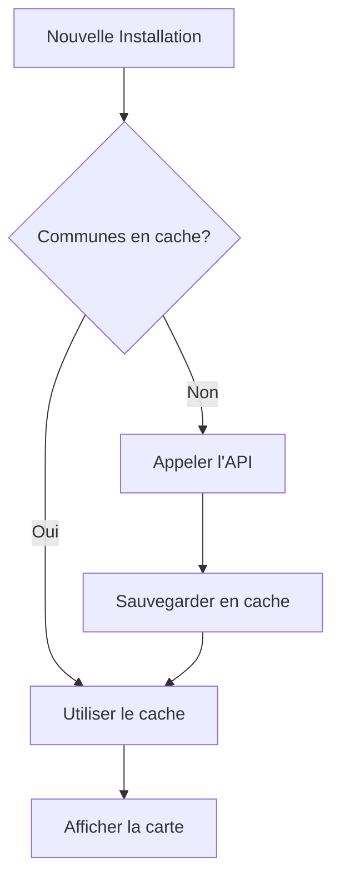

# Guide de Migration vers le Chargement à la Demande

## Problème

Avec plus de 2 millions de consommateurs dans la base Supabase, vous dépassez les limites de capacité.

## Solution

Transformer Supabase en **cache intelligent** plutôt qu'en stockage principal :
- Les données restent dans votre API externe
- Supabase stocke uniquement les données des communes actives
- Chargement automatique à la demande lors des recherches

## Architecture

```
API Externe (2M+ consommateurs)
        ↓
   [Chargement à la demande]
        ↓
Supabase (cache des communes actives)
        ↓
   Application Web
```

## Étapes de Migration

### 1. Configurer l'API Externe

Dans le Dashboard, cliquez sur **"+ Afficher le test de performance API"**.

Configurez :
- **URL de l'API** : L'endpoint de votre API externe
- **Clé API** (optionnel) : Si votre API nécessite une authentification
- **Format attendu** : L'API doit accepter les paramètres `?code_commune=XXX&annee=YYYY`

Exemple d'URL :
```
https://api.votredomaine.com/v1/consommateurs
```

L'API doit retourner un tableau JSON de consommateurs :
```json
[
  {
    "adresse": "1 Rue de la Paix",
    "code_commune": "76540",
    "nom_commune": "Rouen",
    "nombre_sites": 1,
    "consommation_annuelle_mwh": 150,
    "tranche_conso": "100 à 250 MWh",
    "categorie_activite": "Activités de services",
    "annee": 2024
  }
]
```

### 2. Tester les Performances

1. Saisissez quelques codes communes représentatifs (ex: `76540,76462,76575`)
2. Cliquez sur **"Tester les performances"**
3. Analysez les résultats :
   - ✅ **< 1s par commune** : Excellent, migration recommandée
   - ✅ **1-3s par commune** : Bon, migration possible
   - ⚠️ **3-5s par commune** : Moyen, à tester en conditions réelles
   - ❌ **> 5s par commune** : Lent, migration non recommandée

### 3. Nettoyer la Base de Données

Si les performances sont satisfaisantes :

1. Cliquez sur **"Nettoyer la BDD"**
2. Confirmez l'opération

Cette action va :
- Conserver uniquement les consommateurs des communes liées à vos installations enregistrées
- Supprimer tous les autres consommateurs
- Libérer de l'espace dans Supabase

**⚠️ Attention** : Les données supprimées seront rechargées automatiquement depuis l'API lors des prochaines recherches.

### 4. Utilisation Normale

Après la migration :

1. **Lors d'une recherche** : Les consommateurs des communes concernées sont chargés automatiquement depuis l'API
2. **Mise en cache** : Les données chargées restent en cache dans Supabase
3. **Recherches suivantes** : Utilisation du cache (pas d'appel API)

## Configuration Programmatique

Si vous souhaitez configurer l'API via le code :

```typescript
import { configureAPI } from './services/externalConsumersAPI';

configureAPI({
  baseUrl: 'https://api.votredomaine.com/v1',
  apiKey: 'votre-clé-api',
  headers: {
    'Content-Type': 'application/json',
    'Custom-Header': 'valeur'
  }
});
```

## Workflow de Chargement



## Avantages

✅ **Réduction drastique** de l'espace utilisé dans Supabase
✅ **Données toujours à jour** depuis la source
✅ **Cache intelligent** pour les communes fréquemment consultées
✅ **Chargement transparent** pour l'utilisateur
✅ **Scalabilité** : fonctionne avec des millions de consommateurs

## Monitoring

Le système affiche automatiquement :
- Nombre de communes chargées depuis l'API
- Nombre de communes depuis le cache
- Durée de chargement
- Nombre total de consommateurs

## Gestion du Cache

### Vider le Cache Complet
```typescript
import { supabase } from './supabaseClient';

await supabase.from('consommateurs').delete().neq('id', 0);
```

### Recharger une Commune Spécifique
```typescript
import { loadConsumersOnDemand } from './services/externalConsumersAPI';

await loadConsumersOnDemand(['76540'], 2024, true); // forceReload = true
```

## Troubleshooting

### "API non configurée"
→ Configurez l'URL de l'API dans le composant de test

### "Erreur HTTP 401/403"
→ Vérifiez votre clé API et les headers d'authentification

### "Query read timeout"
→ L'API est trop lente, considérez :
- Optimiser les requêtes côté API
- Ajouter de la pagination
- Augmenter le timeout

### Les données ne se chargent pas
→ Vérifiez dans la console les logs commençant par `🌐` et `✅`

## Support

Pour toute question sur la migration, consultez les logs dans la console du navigateur.
Les messages sont préfixés par des emojis pour faciliter le suivi :
- 🌐 : Chargement depuis l'API
- 💾 : Utilisation du cache
- ✅ : Opération réussie
- ❌ : Erreur
